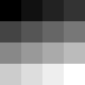
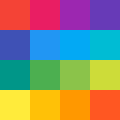

**Binary Bmp** 是纯 JS 编写的无依赖的位图文件生成器，可从**像素数据**或 **canvas 对象**生成单色、VGA、灰度、RGB、RGBA 位图文件。

* [安装](#安装)
* [使用](#使用)
	* [单色位图](#单色位图)
	* [VGA 位图](#vga位图)
	* [灰度位图](#灰度位图)
	* [RGB 位图](#rgb位图)
	* [RGBA 位图](#rgba位图)
* [canvas转位图](#canvas转位图)
* [示例](#示例)

### 安装

```sh
npm install binary-bmp
```

### 引入

**ESM**
```js
import { make } from 'binary-bmp';
```

**CJS**
```js
const { make } = require('binary-bmp');
```

**HTML**
```html
<script src="./binary-bmp/dist/index.iife.js"></script>
<script>
  const { make } = window.Bmp;
</script>
```

### 使用
```js
import { make } from 'binary-bmp';

const uint8array = make({
  bits: 1, // 颜色位值
  width: 3, // 图片宽度
  height: 3, // 图片高度
  data: [ // 像素数据
    0,1,0,
    1,1,1,
    0,1,1,
  ],
});
```
位图可以分为以下几种：

| 名称 | 颜色位值 | 能表示的颜色数量 | 数组元素取值范围 | 颜色表(调色板) | 数组元素含义 |
| --- | :-: | :-: | :-: | :-: | :-: |
| 单色位图  | 1  | 2       | 0 ~ 1   | ✅ | 颜色表索引 |
| VGA位图  | 4  | 16      | 0 ~ 15  | ✅ | 颜色表索引 |
| 灰度位图  | 8  | 256     | 0 ~ 255 | ✅ | 颜色表索引 |
| RGB位图  | 24 | ....... | 0 ~ 255 | 无 | RGB分量值 |
| RGBA位图 | 32 | ....... | 0 ~ 255 | 无 | RGBA分量值 |

----
### 单色位图

单色位图的颜色位值为 `1bit`，只能表示 `2^1=2` 种颜色，可用于热敏打印机。所以 `data` 数组中元素为 `0` 或 `1` 两种，默认 0 表示黑色 1 表示白色:

```js
const binary = make({
  bits: 1,
  width: 3,
  height: 3,
  data: [
    0,1,0,
    1,1,1,
    0,1,1,
  ],
});
```


但是我们可以使用 `palette` 属性自定义颜色表:

```js
const binaryPalette = make({
  bits: 1,
  width: 3,
  height: 3,
  data: [
    0,1,0,
    1,1,1,
    0,1,1,
  ],
  palette: [
    '#F44336',
    '#FFFFFF',
  ],
});
```


此时 `0` 表示颜色表中索引为0的颜色即 `#F44336`（红色），`1` 表示颜色表中索引为1的颜色即 `#FFFFFF`（白色）

----

### VGA位图

VGA位图的颜色位值为 `4bit`，能表示 `2^4=16` 种颜色。所以 `data` 数组中元素取值范围为 `0`-`15`，默认 0 至 15 表示从黑色到白色均匀分布的16个颜色:

```js
const vga = make({
  bits: 4,
  width: 4,
  height: 4,
  data: [
    0,1,2,3,
    4,5,6,7,
    8,9,10,11,
    12,13,14,15,
  ],
});
```



VGA 位图也可以自定义颜色表:

```js
const vgaPalette = make({
  bits: 4,
  width: 4,
  height: 4,
  data: [
    0,1,2,3,
    4,5,6,7,
    8,9,10,11,
    12,13,14,15,
  ],
  palette: [
    '#F44336',
    '#E91E63',
    '#9C27B0',
    '#673AB7',
    '#3F51B5',
    '#2196F3',
    '#03A9F4',
    '#00BCD4',
    '#009688',
    '#4CAF50',
    '#8BC34A',
    '#CDDC39',
    '#FFEB3B',
    '#FFC107',
    '#FF9800',
    '#FF5722',
  ],
});
```



自定义颜色表中颜色数量可以少于16个。例如 data 数组中最大的索引只到 7，那么自定义 7 个颜色就足够了，当自定义颜色少于 7 个时，剩下的颜色会被填充为黑色。

---

### 灰度位图

灰度位图的颜色位值为 `8bit`，能表示 `2^8=256` 种颜色，即我们常见的黑白图片。所以 `data` 数组中元素取值范围为 `0`-`255`，默认的 0 至 255 表示从黑色到白色均匀分布的256种颜色:

```js
const grey = make({
  bits: 8,
  width: 4,
  height: 4,
  data: [
    0,17,34,51,
    68,85,102,119,
    136,153,170,187,
    204,221,238,255,
  ],
});
```


灰度位图同样可以自定义颜色表。由于灰度位图能表示`2^8=256`种颜色，所以自定义颜色表中最多可能有256个颜色，代码太长故不在此展示。

---

### RGB位图

RGB位图的颜色位值为 `24bit`，这 24 bit 由 `8bit + 8bit + 8bit` 组成，表示一个像素点的 `red, green, blue` 三个分量，即我们常见的彩色图片。所以 `data` 数组中元素取值范围为 `0`-`255`，每 3 个为一组按 `RGB` 的顺序表示一个像素点的颜色:

```js
const rgb = make({
  bits: 24,
  width: 3,
  height: 1,
  data: [
    255,0,0, 255,255,0, 0,0,0,
  ],
});
```


由于RGB位图的数据直接表示`颜色值`而不是`颜色表索引`，所以不再需要颜色表。

---

### RGBA位图

RGBA位图颜色位值为 `32bit`，相较于 RGB 位图只多了一个 8bit 的 `A(alpha)` 分量来表示不透明度。`data` 数组每 `4` 个元素为一组按 `RGBA` 的顺序表示一个像素点的颜色:

```js
const rgba = make({
  bits: 32,
  width: 3,
  height: 1,
  data: [
    255,0,0,0, 0,255,0,128, 0,0,255,255,
  ],
});
```


同样的，RGBA位图没有颜色表。

### Canvas转位图

支持将 canvas 转为 RGBA 位图、灰度位图、单色位图:

```js
import { fromCanvas } from 'binary-bmp';

const canvas = document.getElementById('canvas-id');

const rgba = fromCanvas(32, canvas);
const grey = fromCanvas(8, canvas);
const binary = fromCanvas(1, canvas);
```


### 增强代码的可读性

由于需要记住每种位图的颜色位值很麻烦，维护代码时也很容易忘记每种颜色位值代表的位图种类，所以包导出了5个以位图名称命名的位图颜色位值:


```js
import { BINARY, VGA, GREY, RGB, RGBA } from 'binary-bmp';

BINARY === 1
VGA    === 4
GREY   === 8
RGB    === 24
RGBA   === 32
```

### 示例

参考本仓库 [examples](./examples) 目录下的例子:
 - 服务器使用请参考：[node.js](./examples/node.js)
 - 浏览器使用请参考：[browser.js](./examples/browser.js)

```js
// 保存到本地
// 生成临时 Blob URL
// 生成 base64 data URL
```
