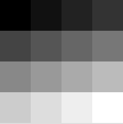
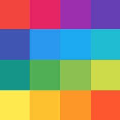
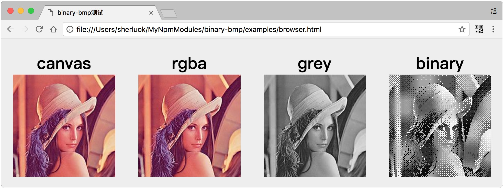

**Binary Bmp**可以将**数组**或**canvas**转为位图格式的文件。纯JS编写，利用ES6的ArrayBuffer对象操作二进制数实。现支持单色位图、VGA位图、灰度位图、RGB位图、RGBA位图。

* [安装](#安装)
* [使用](#使用)
	* [单色位图](#单色位图)
	* [VGA位图](#vga位图)
	* [灰度位图](#灰度位图)
	* [RGB位图](#rgb位图)
	* [RGBA位图](#rgba位图)
* [Canvas转位图](#canvas转位图)
* [示例](#示例)

### 安装

Npm:

	npm install binary-bmp

浏览器:

	<script src="./lib/Bmp.min.js"></script>

### 使用
```javascript
const Bmp = require('binary-bmp');

const bit = 1; // 颜色位值
const width = 3; // 图片宽度
const height = 3; // 图片高度
const data = [ // 像素数据
  0,1,0,
  1,1,1,
  0,1,1
];

const bmp = new Bmp(bit, { width, height, data });

console.log(bmp.getBuffer()); // Uint8Array [...]
console.log(bmp.getBase64()); // data:image/bmp;base64,Qk1KAA...
```
Bitmap位图可以分为以下几种：

| 名称 | 颜色位值(bit) | 能表示的颜色数量(2^bit) | 数组元素取值范围 | 颜色表(调色板) | 数组元素含义 |
| --- | :-: | :-: | :-: | :-: | :-: |
| 单色位图  | 1  | 2       | 0 ~ 1   | 有 | 颜色表索引 |
| VGA位图  | 4  | 16      | 0 ~ 15  | 有 | 颜色表索引 |
| 灰度位图  | 8  | 256     | 0 ~ 255 | 有 | 颜色表索引 |
| RGB位图  | 24 | ....... | 0 ~ 255 | 无 | 颜色值 |
| RGBA位图 | 32 | ....... | 0 ~ 255 | 无 | 颜色值 |

----
### 单色位图

单色图的颜色位值为`1bit`，能表示`2^1=2`种颜色。所以传入的参数`data`数组中元素为`0`或`1`两种，默认的0表示黑色，1表示白色:

```javascript
const binary = new Bmp(1, {
  width: 3,
  height: 3,
  data: [
    0,1,0,
    1,1,1,
    0,1,1,
  ],
});
console.log(binary.getBuffer());
console.log(binary.getBase64());
```


但是我们可以调用`setPalette`方法来自定义颜色表，代码如下。此时`0`表示颜色表中索引为0的颜色`#F44336`红色，`1`表示颜色表中索引为1的颜色`#FFFFFF`白色:

```javascript
binary.setPalette([
  'F44336',
  'FFFFFF',
]);
console.log(binary.getBuffer());
console.log(binary.getBase64());
```


----
### VGA位图
VGA图的颜色位值为`4bit`，能表示`2^4=16`种颜色。所以传入的参数`data`数组中元素取值范围为`0`-`15`，默认的0至15表示从黑色到白色均匀分布的16种颜色:

```javascript
const vga = new Bmp(4, {
  width: 4,
  height: 4,
  data: [
    0,1,2,3,
    4,5,6,7,
    8,9,10,11,
    12,13,14,15,
  ],
});
```


VGA图也可以自定义颜色表:

```javascript
vga.setPalette([
  'F44336',
  'E91E63',
  '9C27B0',
  '673AB7',
  '3F51B5',
  '2196F3',
  '03A9F4',
  '00BCD4',
  '009688',
  '4CAF50',
  '8BC34A',
  'CDDC39',
  'FFEB3B',
  'FFC107',
  'FF9800',
  'FF5722',
]);
```


---
### 灰度位图

灰度图的颜色位值为`8bit`，能表示`2^8=256`种颜色，即我们常见的黑白图片。所以传入的参数`data`数组中元素取值范围为`0`-`255`，默认的0至255表示从黑色到白色均匀分布的256种颜色:

```javascript
const grey = new Bmp(8, {
  width: 4,
  height: 4,
  data: [
    0,17,34,51,
    68,85,102,119,
    136,153,170,187,
    204,221,238,255,
  ],
});
```


灰度图同样可以自定义颜色表，由于灰度图有`2^8=256`种颜色，所以传入`setPalette`方法的数组有256个元素，代码太长，故不在此展示。

---
### RGB位图
RGB图的颜色位值为`24bit`，这24bit由`8bit + 8bit + 8bit`组成，表示一个像素点的`red, green, blue`三原色色值，即我们常见的彩色图片。所以传入的参数`data`数组中元素取值范围为`0`-`255`，每3个为一组按`RGB`的顺序表示一个像素点的颜色:

```javascript
const rgb = new Bmp(24, {
  width: 3,
  height: 1,
  data: [
    255,0,0, 255,255,0, 0,0,0,
  ],
});
```


在有些情况下，我们提供的数据可能是`BGR`的顺序，这时只需调用`bgr`方法即可:

```javascript
rgb.bgr().getBase64();
```


由于RGB位图的数据直接表示`颜色值`而不是`颜色表索引`，所以不再需要颜色表。

---
### RGBA位图

RGBA图颜色位值为`32bit`，相较于RGB只多了一个8bit的`A(alpha)`来表示不透明度。`data`数组每`4`个元素为一组按`RGBA`的顺序表示一个像素点的颜色:

```javascript
const rgba = new Bmp(32, {
  width: 3,
  height: 1,
  data: [
    255,0,0,0, 0,255,0,128, 0,0,255,255,
  ],
});
```


同样的，当数据是`BGRA`顺序的时候，调用`bgr`方法即可。<br>
同样的，RGBA位图没有颜色表。

### Canvas转位图

支持将canvas转为RGBA位图、灰度位图、单色位图:

```javascript
const canvas = document.getElementById('canvas-id');

const rgba = new Bmp(32, canvas);
const grey = new Bmp(8, canvas);
const binary = new Bmp(1, canvas);
```


### 增强代码的可读性

由于需要记住每种位图的颜色位值很麻烦，维护代码时也很容易忘记每种颜色位值代表的位图种类，所以`Bmp`类有5个以位图名称命名的`静态属性`保存了5种位图的颜色位值:

```javascript
Bmp.BINARY === 1
Bmp.VGA    === 4
Bmp.GREY   === 8
Bmp.RGB    === 24
Bmp.RGBA   === 32
```

```javascript
const binary = new Bmp(Bmp.BINARY, {
  width: 3,
  height: 3,
  data: [
    0,1,0,
    1,1,1,
    0,1,1,
  ],
});
```

### 示例

参考本项目`examples`目录下的[node.js](./examples/node.js)和[browser.js](./examples/browser.js)
