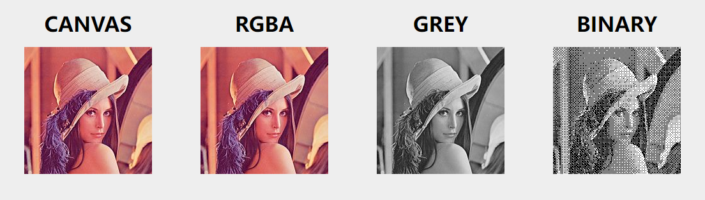

**binary-bmp** 是纯 Javascript 编写的无依赖的位图文件生成器，可由像素数据数组或 Canvas 对象生成各种颜色位值的位图文件。

- [安装](#安装)
- 创建位图
	- [单色位图](#单色位图)
	- [VGA 位图](#vga-位图)
	- [灰度位图](#灰度位图)
	- [RGB 位图](#rgb-位图)
	- [RGBA 位图](#rgba-位图)
  - [Canvas 转位图](#Canvas-转位图)
  - [读取位图文件](#读取位图文件)
- 修改位图
  - [位值转换](#位值转换)
  - [垂直翻转](#垂直翻转)
- 温馨小提示
  - [关于自定义颜色表](#自定义颜色表)
  - [关于透明度通道](#透明度通道)
- 示例
  - [`./docs`](./docs)
  - [`https://sherluok.github.io/binary-bmp`](https://sherluok.github.io/binary-bmp/)

### 安装

```sh
npm install binary-bmp
```

### 引入

```typescript
import { Bitmap, Bits } from 'binary-bmp';
```

**CJS**

```typescript
const { Bitmap, Bits } = require('binary-bmp');
```

**HTML**

```html
<script src="./node_modules/binary-bmp/index.iife.js"></script>
<script>
  const { Bitmap, Bits } = window.Bmp;
</script>
```

### 使用
```typescript
import { Bitmap, Bits } from 'binary-bmp';

const rgba = Bitmap.fromCanvas(canvasElement); // 从Canvas生成位图对象
const binary = rgba.bits(Bits.BINARY); // 转换颜色位值，生成新的位图对象
const file = binary.uint8Array(); // 生成位图文件数据
```

---

位图按照颜色位值分为以下五类:

| 名称 | 颜色位值 | 颜色数量 | 数组元素取值范围 | 颜色表 | 数组元素含义
| --- | :-: | :-: | :-: | :-: | :-:
| 单色位图  | `1`  | `2`       | `0` ~ `1`   | ✅ | 颜色表索引 |
| VGA 位图  | `4`  | `16`      | `0` ~ `15`  | ✅ | 颜色表索引 |
| 灰度位图  | `8`  | `256`     | `0` ~ `255` | ✅ | 颜色表索引 |
| RGB 位图  | `24` | ....... | `0` ~ `255` | 无 | `R`, `G`, `B` 分量值 |
| RGBA 位图 | `32` | ....... | `0` ~ `255` | 无 | `R`, `G`, `B`, `A` 分量值 |

库导出了这五个以位图名称命名的位图颜色位值，以方便维护：

```typescript
import { Bits } from 'binary-bmp';

assert(Bits.BINARY ===  1);
assert(Bits.VGA    ===  4);
assert(Bits.GREY   ===  8);
assert(Bits.RGB    === 24);
assert(Bits.RGBA   === 32);
```
---

### 单色位图

单色位图通常用于热敏打印机。其颜色位值为 `1 bit`，只能表示 `2 ^ 1 = 2` 种颜色。像素数组中的每一个元素表示一个像素，且只能取 `0` 或 `1`，默认情况下 `0` 表示黑色，`1` 表示白色:

```typescript
const binary = new Bitmap({
  bits: 1,
  width: 3,
  height: 3,
  data: [
    0, 1, 0,
    1, 1, 1,
    0, 1, 1,
  ],
});
```


但是我们可以使用 `palette` 属性自定义颜色表:

```typescript
new Bitmap({
  ...
  palette: [
    '#F44336', // 像素数值为 0 的显示为红色
    '#FFFFFF', // 像素数值为 1 的显示为白色
  ],
});
```


---

### VGA 位图

VGA 位图的颜色位值为 `4 bit`，能表示 `2 ^ 4 = 16` 种颜色。像素数组中的每一个元素表示一个像素，取值范围为 `0 ~ 15`，默认 0 至 15 表示从黑色到白色均匀过渡的 16 个颜色:

```typescript
const vga = new Bitmap({
  bits: 4,
  width: 4,
  height: 4,
  data: [
     0,  1,  2,  3,
     4,  5,  6,  7,
     8,  9, 10, 11,
    12, 13, 14, 15,
  ],
});
```


VGA 位图也可以自定义颜色表:

```typescript
new Bitmap({
  ...
  palette: [
    '#F44336',
    '#E91E63',
    '#9C27B0',
    '#673AB7',
    '#3F51B5',
    '#2196F3',
    '#03A9F4',
    '#00BCD4',
    '#009688',
    '#4CAF50',
    '#8BC34A',
    '#CDDC39',
    '#FFEB3B',
    '#FFC107',
    '#FF9800',
    '#FF5722',
  ],
});
```


---

### 灰度位图

灰度位图即我们常见的黑白图片，其颜色位值为 `8 bit`，能表示 `2 ^ 8 = 256` 种颜色。像素数组中的每一个元素表示一个像素，取值范围为 `0 ~ 255`，默认 0 至 255 表示从黑色到白色均匀过渡的 256 个颜色:

```typescript
const grey = new Bitmap({
  bits: 8,
  width: 4,
  height: 4,
  data: [
      0,  17,  34,  51,
     68,  85, 102, 119,
    136, 153, 170, 187,
    204, 221, 238, 255,
  ],
});
```


灰度位图同样可以自定义颜色表。由于灰度位图的自定义颜色表中最多可能有 256 个颜色，代码太长故不在此展示。

---

### RGB 位图

RGB位图即常见的彩色图片，其颜色位值为 `24 bit`。像素数组中的每个三元素为一组按照 `R(red), G(green), B(blue)` 的顺序表示一个像素，取值范围为 `0 ~ 255`:

```typescript
const rgb = new Bitmap({
  bits: 24,
  width: 3,
  height: 1,
  data: [
    255,0,0, 255,255,0, 0,0,0,
  ],
});
```


RGB 位图的像素数据直接表示颜色值而不是索引，所以无需颜色表。

---

### RGBA 位图

RGBA 位图颜色位值为 `32 bit`，相较于 RGB 位图只多了一个 `8 bit` 的 `A(alpha)` 分量来表示透明度。像素数组中的每个三元素为一组按照 `R, G, B, A` 的顺序表示一个像素，取值范围为 `0 ~ 255`:

```typescript
const rgba = new Bitmap({
  bits: 32,
  width: 3,
  height: 1,
  data: [
    255,0,0,0, 0,255,0,128, 0,0,255,255,
  ],
});
```


---

### Canvas 转位图

可以从包括 [HTMLCanvasElement](https://developer.mozilla.org/en-US/docs/Web/API/HTMLCanvasElement)、[OffscreenCanvas](https://developer.mozilla.org/en-US/docs/Web/API/OffscreenCanvas)、[node-canvas](https://github.com/Automattic/node-canvas) 在内等实现了 [Canvas](https://developer.mozilla.org/en-US/docs/Web/API/Canvas_API) 接口的对象生成 RGBA 位图对象：

```typescript
const canvas = document.getElementById('canvas-id');

const rgba = Bitmap.fromCanvas(canvas);

const grey = rgba.bits(8);
const binary = rgba.bits(1);

const url = URL.createObjectURL(rgba.blob());
```



---

### 读取位图文件

通过 Node.js FS API 或 Fetch API 等途径读取位图数据，然后进行解析：

**`Bitmap.fromBuffer(data: ArrayBuffer | Uint8Array): Bitmap`**


```typescript
import { readFile } from 'node:fs/promise';

const buffer = await readFile('./some.bmp');
const bitmap = Bitmap.fromBuffer(buffer);

console.log(bitmap.bit());
console.log(bitmap.width());
console.log(bitmap.height());
console.log(bitmap.data());
```
---

### 位值转换

**`bitmap.bits(target: Bits): Bitmap`**

```typescript
rgbaBitmap.bits(Bits.BINARY);
rgbaBitmap.bits(Bits.GREY);
rgbaBitmap.bits(Bits.RGB);
```

### 垂直翻转

**`bitmap.flip(): this`**

---

### 自定义颜色表

只有 1 位单色位图、4 位 VGA 位图、8 位灰度位图有自定义颜色表（调色板）。颜色表中最多有 `2 ^ n` 个颜色，其中 `n` 为位图的颜色位值。
例如 4 位 VGA 位图的自定义颜色表中最多可以有 `2 ^ 4 = 16` 个颜色。具体数量可以少于 16 个，例如像素数据数组中最大的索引只到 7，那么自定义 7 个颜色就足够了，当自定义颜色少于 7 个时，剩下的颜色会被填充为黑色。

### 透明度通道

⚠️ 虽然 RGBA 位图文件数据中声明了透明度通道，但包括浏览器在内的大多数软件都会忽略透明度通道，只有 Photoshop 这类专业软件才会正常渲染出半透明效果。除非你确定需要生成 RGBA 位图并在专业软件中使用，否则建议生成 RGB 位图。

**`bitmap.background(color: string): this`**

从 Canvas 或 PNG 等具有透明度通道的数据源生成位图文件时，你可以指定一个背景色（默认白色），数据源像素的颜色会按照其透明度与该背景色混合，以达到模拟透明度的效果：

```typescript
Bitmap.fromCanvas(canvas)
  .bits(Bits.RGB)
  .background('#F5F5F5')
  .uint8Array();
```
